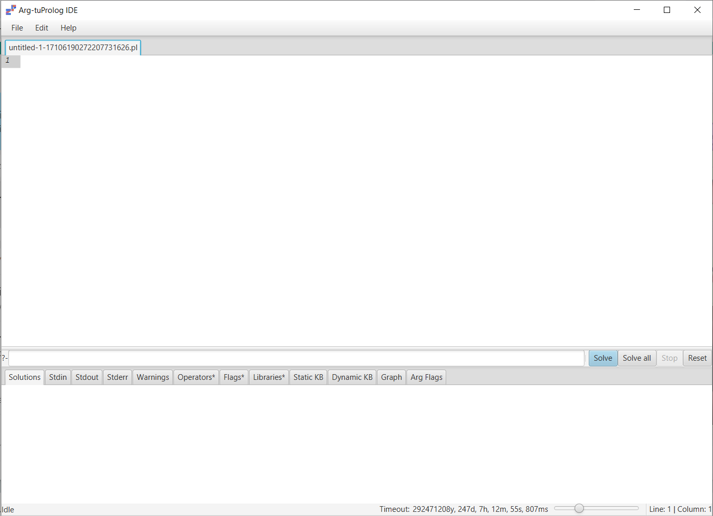

# Arg2P: An argumentation framework for explainable intelligent systems

This repository contains detailed instructions on how to run the examples form the the work _Arg2P: An argumentation framework for explainable intelligent systems_.

## Set up the environment

In this part we will prepare the environment required to run all the examples.

1. Install the [Java runtime](https://adoptium.net/releases.html?variant=openjdk11&jvmVariant=hotspot) (version **11** or above). If Java is already present on your system, you can skip this step.
2. Download the stand-alone [Arg2P Java IDE](https://github.com/tuProlog/arg2p-kt/releases/download/0.5.0/arg2p-ide-0.5.0-redist.jar).
3. If Java is correctly installed, with a double click on the file downloaded at step 2 (__arg2p-ide-0.5.0-redist.jar__), this should be the result.

If nothing happens, check your _Java_ installation by following the instructions at point 1.
4. You are now ready to run the examples! You will find specific instractions under the __example\_\*__ sudirectories (* stands for the example number in the original paper).
