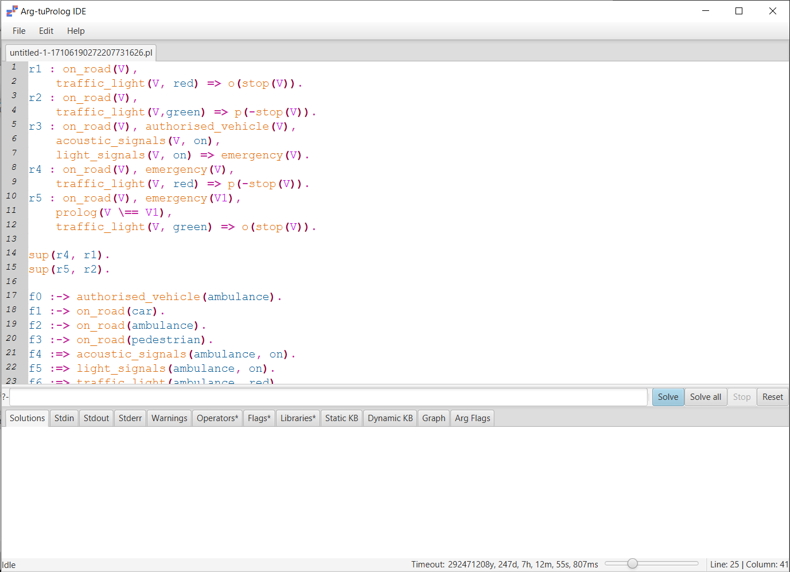
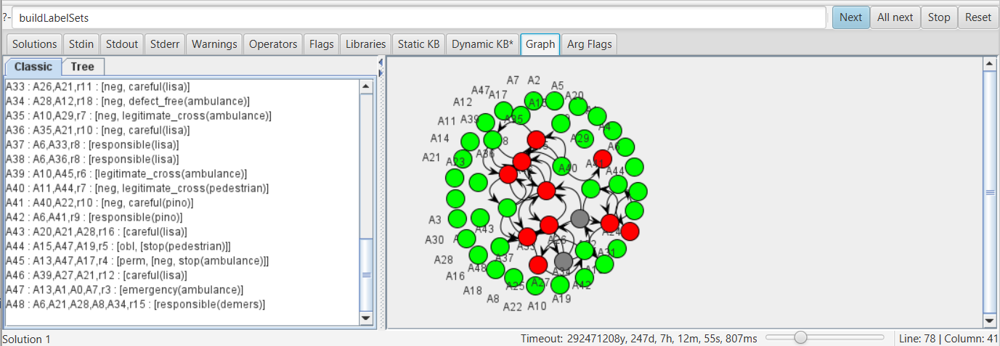

# Example 3 : Autonomous cars, more on legal reasoning

Paste the following theory in the theory section of the __Arg2pIDE__:


```
r1 : on_road(V),
    traffic_light(V, red) => o(stop(V)).
r2 : on_road(V),
    traffic_light(V,green) => p(-stop(V)).
r3 : on_road(V), authorised_vehicle(V),
    acoustic_signals(V, on),
    light_signals(V, on) => emergency(V).
r4 : on_road(V), emergency(V),
    traffic_light(V, red) => p(-stop(V)).
r5 : on_road(V), emergency(V1),
    prolog(V \== V1),
    traffic_light(V, green) => o(stop(V)).

sup(r4, r1).
sup(r5, r2).

f0 :-> authorised_vehicle(ambulance).
f1 :-> on_road(car).
f2 :-> on_road(ambulance).
f3 :-> on_road(pedestrian).
f4 :=> acoustic_signals(ambulance, on).
f5 :=> light_signals(ambulance, on).
f6 :=> traffic_light(ambulance, red).
f7 :=> traffic_light(car, red).
f8 :=> traffic_light(pedestrian, green).

r6 : -stop(V),
    p(-stop(V)) => legitimate_cross(V).
r7 : -stop(V),
    o(stop(V)) => -legitimate_cross(V).
r8 : harms(P1, P2),
    -careful(P1) => responsible(P1).
r9 : harms(P1, P2),
    -careful(P2) => responsible(P2).
r10 : -legitimate_cross(V), 
    user(P, V) => -careful(P).
r11 : high_speed(V), user(P, V)  => -careful(P).
r12 : legitimate_cross(V),
    -high_speed(V), user(P, V)  => careful(P).
r13 : witness(X),
    claim(X, low_speed(V)) => -high_speed(V).
r14 : witness(X),
    claim(X, high_speed(V)) => high_speed(V).

bp(careful(P)).

f9 :-> user(pino, pedestrian).
f10 :-> user(lisa, ambulance).
f11 :-> -stop(ambulance).
f12 :-> -stop(pedestrian).
f13 :-> harms(lisa, pino).
f14 :-> witness(chris).
f15 :-> witness(john).
f16 :=> claim(chris, low_speed(ambulance)).
f17 :=> claim(john, high_speed(ambulance)).

r15 : harms(P1, P2), user(P1, V),
    -working(V), manufacturer(M, V),
    -defect_free(V) => responsible(M).
r16 : tried_to_brake(P), user(P, V),
    -working(V) => careful(P).
r17 : mechanic(M),
    claim(M, defect(V)) => -working(V).
r18 : -working(V), new(V) => -defect_free(V).
r19 : production_manager(P),
    claim(P, test_ok(V)) => defect_free(V).
r20 : test_doc_ok(V) => undercut(r18).

sup(r16, r11).
bp(defect_free(V)).

f19 :-> manufacturer(demers , ambulance).
f20 :=> tried_to_brake(lisa).
f21 :-> mechanic(paul).
f22 :=> claim(paul, defect(ambulance)).
f23 :-> new(ambulance).
f24 :-> production_manager(mike).
f25 :=> claim(mike, test_ok(ambulance)).
```

This should be the result



Now open the __Arg Flags__ tab and configure the engine as follows:


By using these settings, we are requiring the evaluation of the thery according to __bp_grounded__ semantic and using the __last/elitist__ principle for handling preferences. We also disable the __rebut restriction__.

To require the evalution use the predicate `buildLabelSets`. Just put it in the query section (__?-__) and press the __Solve__ button.


When the evaluation is complete, you shold see the following result in the __Solutions__ tab:


You can now explore the result under the __Graph__ tab. There you can find the resulting argumentation graph coloured according to the computed labelling (red for __OUT__ arguments, green for __IN__ arguments, gray for __UND__ arguments).



You can now play with the flags in the __Arg Flags__ tab to customise the evaluation to your needs and explore all the available solutions. For example, try to set the __Argumentation Labelling Mode__ to __grounded__ *(Dung's grounded semantic) to see the influence that burden of persusion constraint has on the solution. You can find a description of the flags and their behaviour in the official [wiki](https://pika-lab.gitlab.io/argumentation/arg2p-kt/wiki/predicate/).